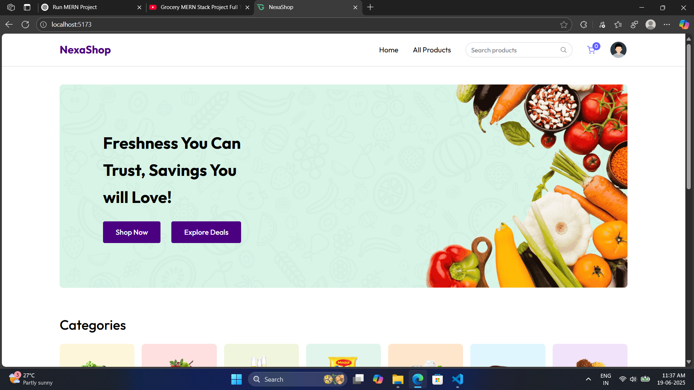
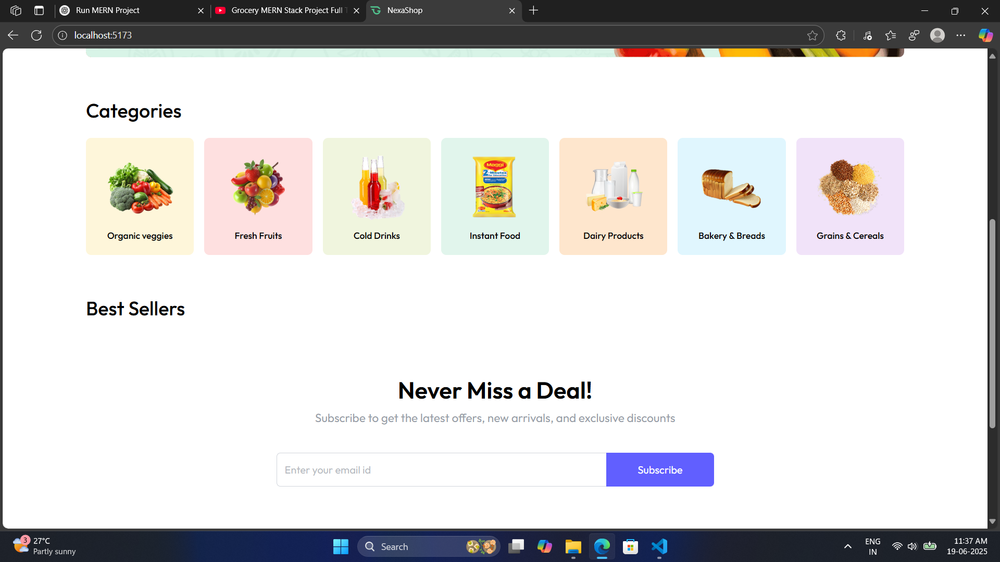
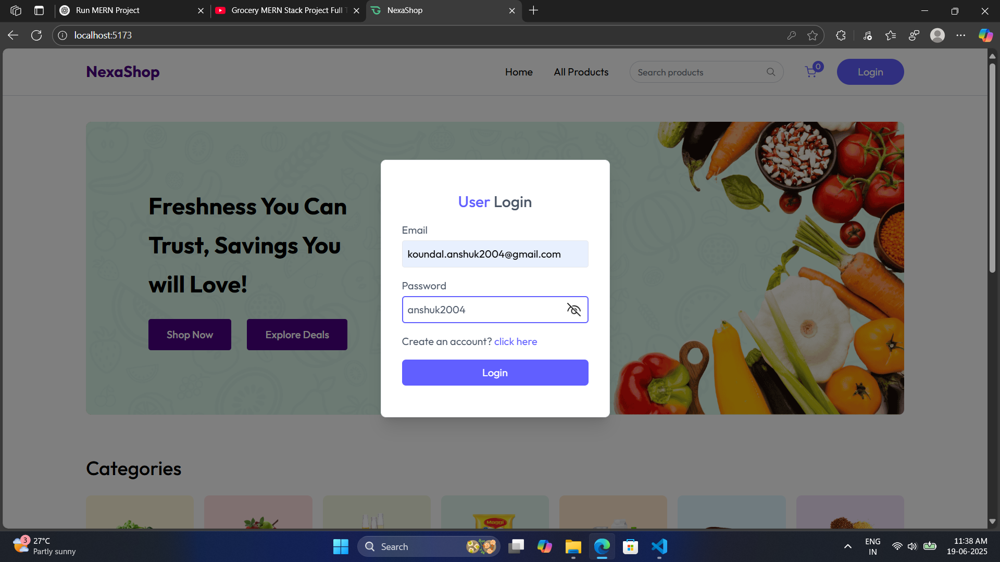

# MERN Stack E-Commerce Website

A complete full-stack E-Commerce application built using MongoDB, Express.js, React.js, and Node.js. The app includes product browsing, category filtering, user authentication, cart management, and order summary (without payment integration).

## Features

* Product listing and detail view
* Search functionality
* Shop by category
* Add to cart
* User registration and login
* Order summary page
* Responsive design

## Tech Stack

* **Frontend**: React, Axios, React Router
* **Backend**: Node.js, Express.js
* **Database**: MongoDB with Mongoose
* **Authentication**: JWT

## Folder Structure

```
root
├── client    # React frontend
├── server    # Express backend
└── README.md
```

## Installation and Running Locally

### Prerequisites

* Node.js and npm
* MongoDB (local or Atlas)
* Git

### 1. Clone the Repository

```
git clone https://github.com/your-username/mern-ecommerce.git
cd mern-ecommerce
```

### 2. Backend Setup

```
cd server
npm install
```

Create a `.env` file in the server folder with:

```
PORT=5000
MONGO_URI=your_mongo_connection_string
JWT_SECRET=your_jwt_secret
```

### 3. Frontend Setup

```
cd ../client
npm install
```

Create a `.env` file in the client folder (if needed):

```
REACT_APP_API_URL=http://localhost:5000/api
```

### 4. Run the App

**Start Backend:**

```
cd server
npm run dev
```

**Start Frontend:**

```
cd ../client
npm start
```

## Screens Completed

* Home page with category filters
* Product listing and details
* Cart page
* Register and Login forms
* Checkout / Order Summary (without payments)

## Missing Features

* Payment gateway (e.g., Stripe, Razorpay)
* Email confirmations
* Product reviews

## Screenshots
## Home

## Categories

## Login


## License

This project is licensed under the MIT License.

---

Feel free to fork and improve this project or raise an issue if you encounter any bugs!
